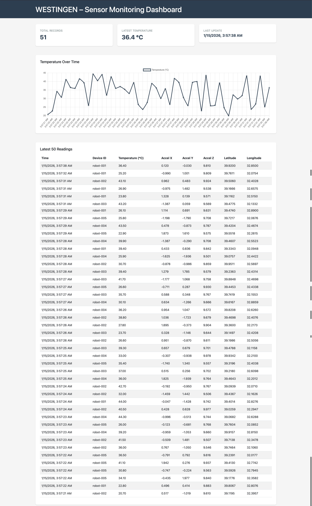
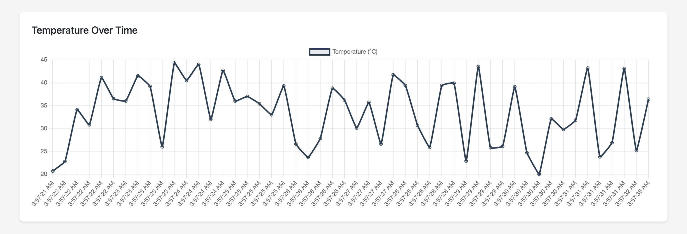
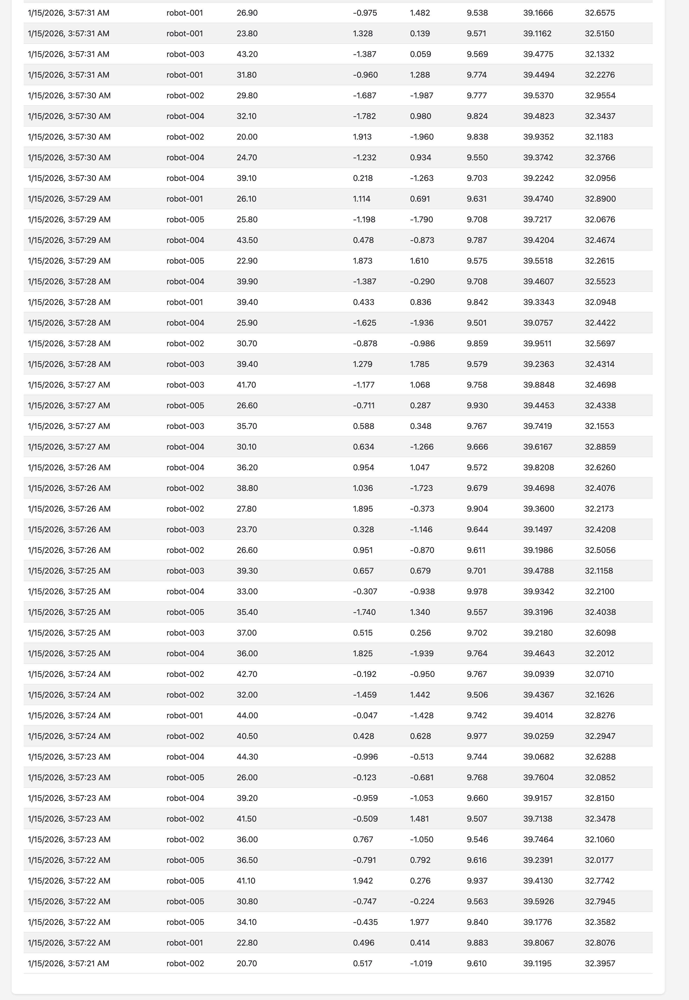

# WESTINGEN

Industrial-style sensor data monitoring demo application.

## What is WESTINGEN?

WESTINGEN is a minimal Flask-based application that demonstrates sensor data ingestion, storage, and visualization. It is designed as a job application demo to showcase backend development skills with Python and Flask.

## Tech Stack

- **Backend**: Python 3.8+, Flask 3.0
- **Database**: PostgreSQL 12+
- **Frontend**: Server-rendered HTML with Bootstrap 5 and Chart.js (via CDN)
- **Dependencies**: psycopg2-binary, requests, python-dotenv

## Setup

### Prerequisites

- Python 3.8 or higher
- PostgreSQL 12 or higher
- pip

### Step-by-Step Setup

1. **Clone and navigate to the project**:
   ```bash
   cd westingen
   ```

2. **Create a virtual environment**:
   ```bash
   python3 -m venv venv
   source venv/bin/activate  # On Windows: venv\Scripts\activate
   ```

3. **Install dependencies**:
   ```bash
   pip install -r requirements.txt
   ```

4. **Set up PostgreSQL database**:
   ```bash
   createdb westingen
   psql westingen < migrations/001_init.sql
   ```

5. **Configure environment variables**:
   ```bash
   cp .env.example .env
   # Edit .env and set your DATABASE_URL if different from default
   ```

## Running the Application

### Start the Flask Server

```bash
python run.py
```

The application will be available at `http://localhost:5001`

**Note:** Port 5001 is used instead of 5000 because macOS reserves port 5000 for AirPlay.

- Dashboard: `http://localhost:5001/`
- Health check: `http://localhost:5001/api/health`

### Generate Sample Data

In a separate terminal, run:

```bash
python scripts/generate_data.py --count 200 --rate 5
```

This will generate 200 sensor readings at a rate of 5 readings per second and send them to the API.

Options:
- `--count`: Number of readings to generate (default: 200)
- `--rate`: Readings per second (default: 5)
- `--device`: Device ID prefix (default: robot-001)
- `--url`: Base URL of the API (default: http://localhost:5001)

## API Endpoints

- `GET /api/health` - Health check endpoint
- `POST /api/ingest` - Ingest sensor data
- `GET /api/latest?limit=50` - Get latest sensor readings
- `GET /api/stats` - Get statistics about sensor readings

### Example: Ingest Sensor Data

```bash
curl -X POST http://localhost:5001/api/ingest \
  -H "Content-Type: application/json" \
  -d '{
    "device_id": "robot-001",
    "temperature_c": 36.4,
    "accel_x": 0.12,
    "accel_y": -0.03,
    "accel_z": 9.81,
    "latitude": 39.92,
    "longitude": 32.85
  }'
```

## Dashboard Features

The dashboard displays:
- **KPI Cards**: Total records, latest temperature, last update time
- **Temperature Chart**: Line chart showing temperature over time (auto-updates every 5 seconds)
- **Data Table**: Latest 50 sensor readings with all fields

## What is Intentionally Omitted

This is a demo application. The following are intentionally not included:

- Authentication and authorization
- Production hardening (HTTPS, rate limiting, etc.)
- Microservices architecture
- React or other SPA frameworks
- Docker containerization
- Unit tests
- CI/CD pipelines

These omissions are by design to keep the demo focused and runnable in under 5 minutes.

## Screenshots

### Dashboard Overview


### Temperature Chart


### Latest Sensor Readings


## License

This is a demo project for job application purposes.
